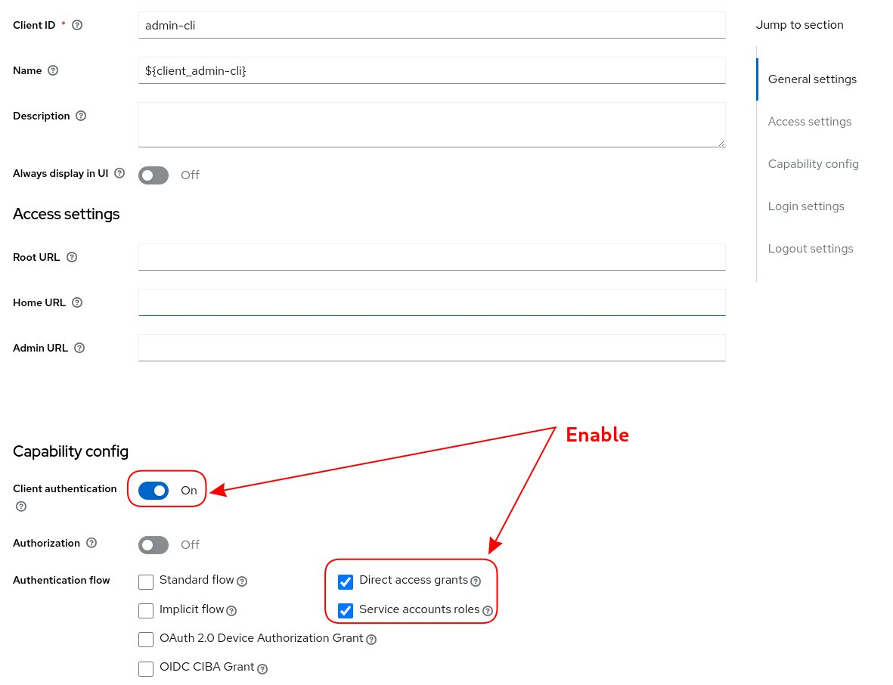
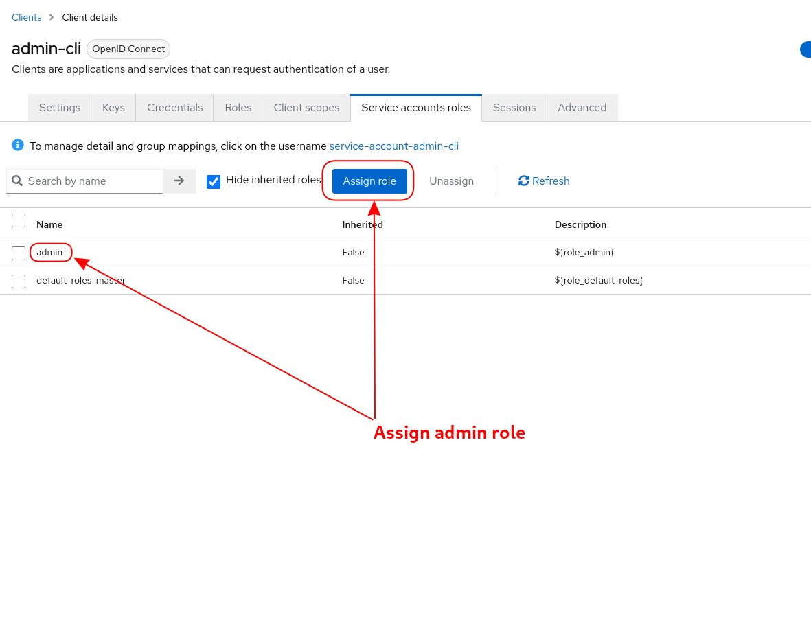
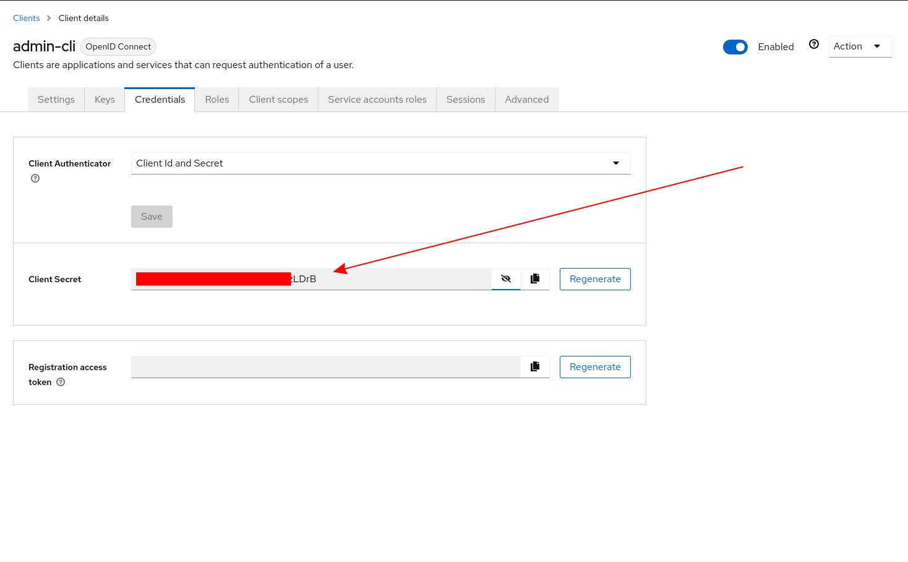

# Description

This example demonstrates how to interact with the Keycloak API using a Python script. The script leverages the client credentials of the admin-cli client in the master realm of a Keycloak installation to retrieve a brief list of all available realms. Additionally, it accepts a `--realm` parameter that allows users to query specific information about clients, client scopes, users, groups, and roles within a specified realm. All API responses are returned in JSON format.

To configure API access, run the command `./kc-api-get.py config` and provide the Keycloak server URL along with the client secret for the admin-cli client in the master realm.

# Configuration

Once Keycloak is up and running, the admin-cli client in the master realm must have enabled the options for `Client authentication`, `Direct access grants` and `Service account roles` (See picture below).

The service account role admin must be granted to the client admin-cli as well. 

Client credentials will be available on the `Credentials` tab

# Usage notes

Configuration is stored locally under `.config` file. It may be needed to give execution permissions (`chmod +x kc-api-get.py`). It requires python +3.10. Execute the help for more information `./kc-api-get.py -h`. 

When the dump `/install/data/keycloak-backup-data.sql` is restored, the client secret is `UD7JNCTD1RkqxIraKk02fcABWXfzLDrB`.

